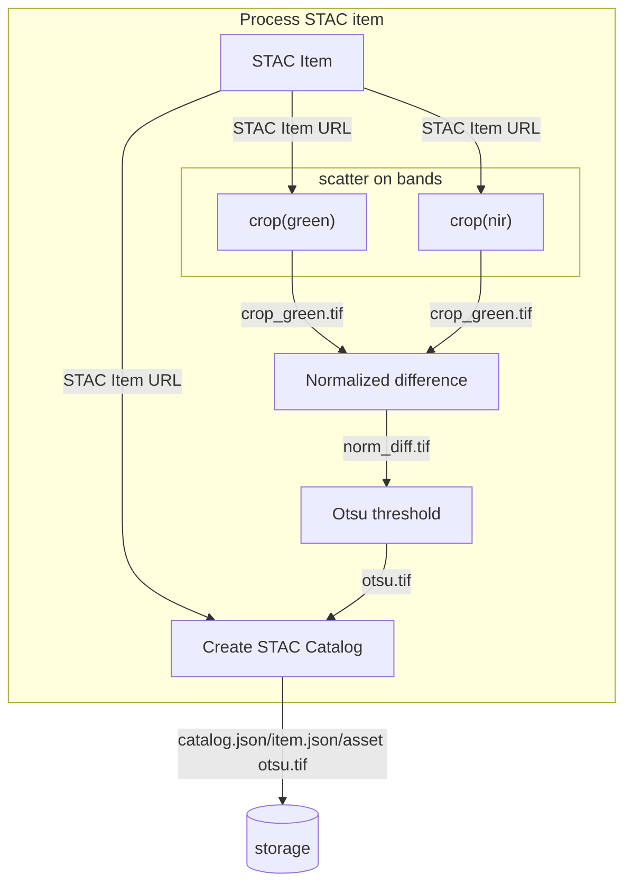
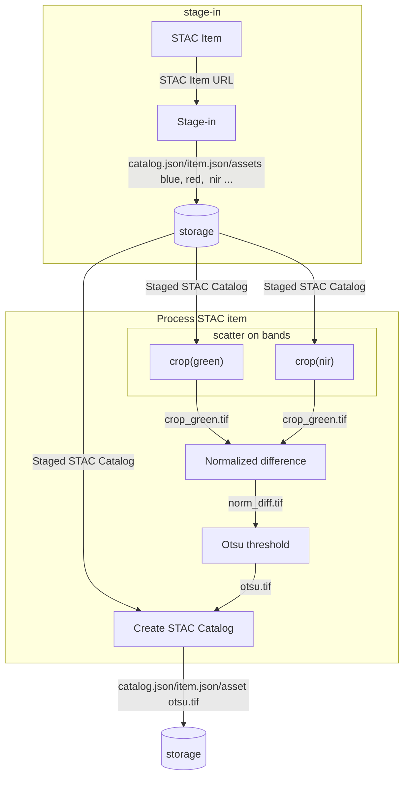

## Water bodies detection 

This application takes as input Copernicus Sentinel-2 or USSG Landsat-9 data and detects water bodies by applying the Otsu thresholding technique on the Normalized Difference Water Index (NDWI).

The NDWI is calculated with: 

$$
NDWI = { (green - nir) \over (green + nir) } 
$$

Typically, NDWI values of water bodies are larger than 0.2 and built-up features have positive values between 0 and 0.2.

Vegetation has much smaller NDWI values, which results in distinguishing vegetation from water bodies easier. 

The NDWI values correspond to the following ranges:

| Range       | Description                            |
| ----------- | -------------------------------------- |
| 0,2 - 1     | Water surface                          |
| 0.0 - 0,2   | Flooding, humidity                     |
| -0,3 - 0.0  | Moderate drought, non-aqueous surfaces |
| -1 - -0.3   | Drought, non-aqueous surfaces          |

To ease the determination of the water surface/non water surface, the Ostu thresholding technique is used. 

In the simplest form, the Otsu algorithm returns a single intensity threshold that separate pixels into two classes, foreground and background. This threshold is determined by minimizing intra-class intensity variance, or equivalently, by maximizing inter-class variance:

The application can be used in two modes:

- take a list of Sentinel-2 STAC items references, applies the crop over the area of interest for the radiometric bands green and NIR, the normalized difference, the Ostu threshold and finally creates a STAC catalog and items for the generated results.

  This scenario is depicted below:

- read staged Landsat-9 data as a STAC Catalog and a STAC item, applies the crop over the area of interest for the radiometric bands green and NIR, the normalized difference, the Ostu threshold and finaly creates a STAC catalog and items for the generated results.

  This scenario is depicted below:

Alice packages the application as an Application Package to include a macro workflow that reads the list of Sentinel-2 STAC items references or Landsat-9 staged data, launches a sub-workflow to detect the water bodies and creates the STAC catalog:

The sub-workflow applies the  `crop`, `Normalized difference`, `Otsu threshold` steps:

The development and test dataset is made of two Sentinel-2 acquisitions:

| Acquisitions 	|                                             	|           |
|--------------	|----------------------------------------------	|----------------------------------------------------------------------------------------------------------------------	| 
| Mission      	|                              Sentinel-2       |     Sentinel-2 |                                   
| Date         	|            2022-05-24                         |                                2021-07-13                                                              	|         2023-10-15 |                                                      
| URL          	| [S2B_10TFK_20210713_0_L2A](https://earth-search.aws.element84.com/v0/collections/sentinel-s2-l2a-cogs/items/S2B_10TFK_20210713_0_L2A) 	| [S2A_10TFK_20220524_0_L2A](https://earth-search.aws.element84.com/v0/collections/sentinel-s2-l2a-cogs/items/S2A_10TFK_20220524_0_L2A) 	| |
| Quicklook    	|           	|                                          	|  |

And one Landsat-9 acquisition:

| Acquisition 	|                                             	|           
|--------------	|----------------------------------------------	|
| Date         	|                            2023-10-15 |                                                      
| URL          	| [LC09_L2SP_042033_20231015_02_T1](https://planetarycomputer.microsoft.com/api/stac/v1/collections/landsat-c2-l2/items/LC09_L2SP_042033_20231015_02_T1)                                      |
| Quicklook    	|  |

Each `Command Line Tool` step such as `crop`, `Normalized difference`, `Otsu threshold` and `Create STAC` runs a simple Python script in a dedicated container.

