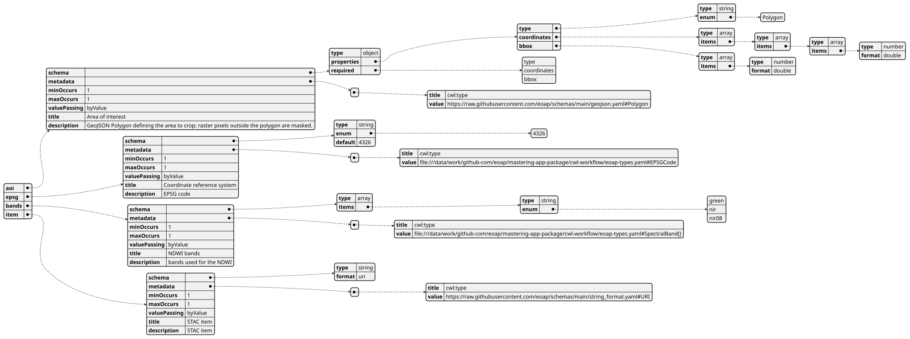
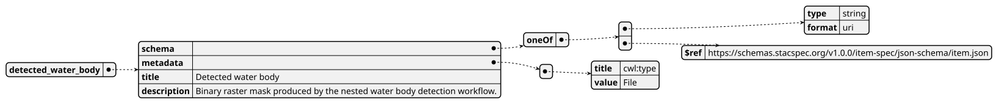
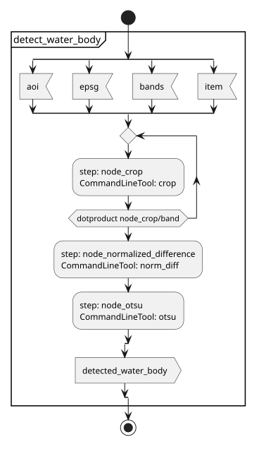
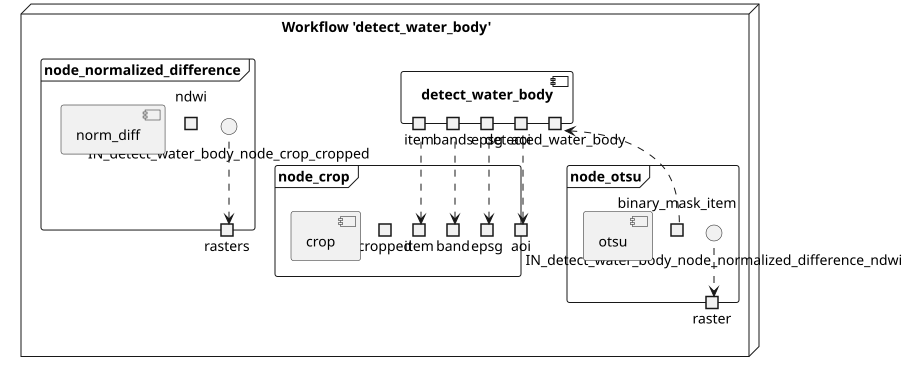
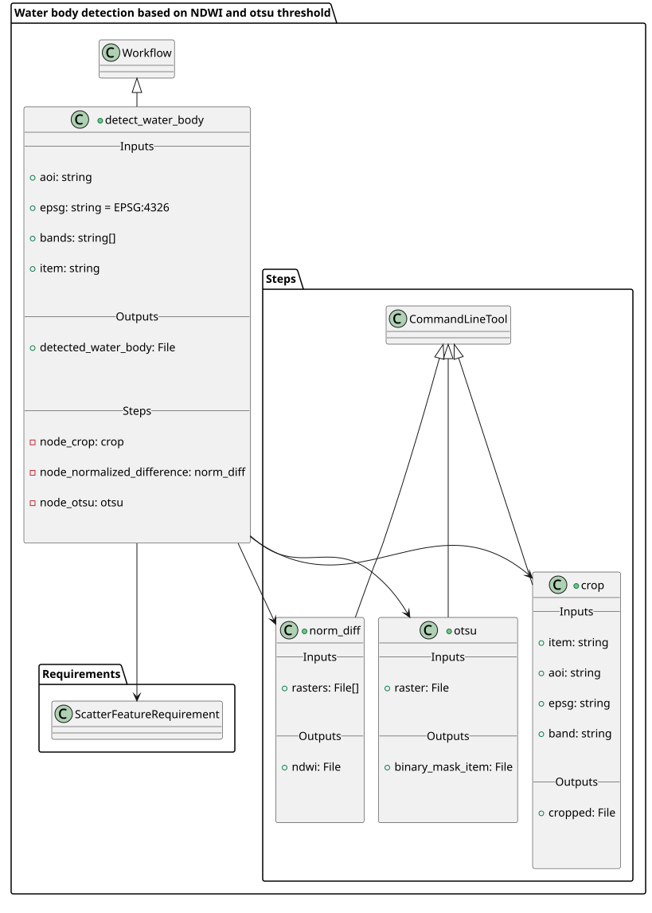
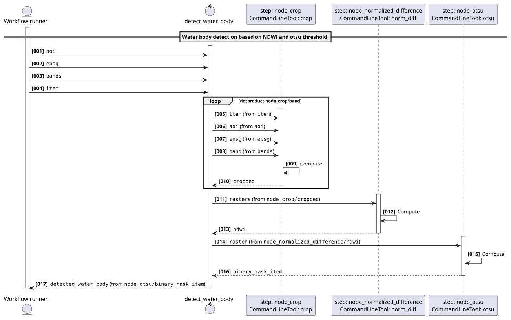
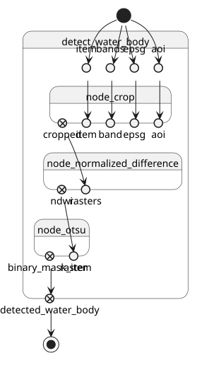

# Water bodies detection based on NDWI and otsu threshold v1.4.1

Water bodies detection based on NDWI and otsu threshold applied to Sentinel-2 COG STAC items

> This software is licensed under the terms of the [Creative Commons Attribution-ShareAlike 4.0 International](https://creativecommons.org/licenses/by-sa/4.0/) license - SPDX short identifier: [CC-BY-SA-4.0](https://spdx.org/licenses/CC-BY-SA-4.0)
>
> 2022-09-01 - 2026-10-10T20:29:45.005 Copyright [EO Application Packaging](mailto:None) - > [https://github.com/eoap](https://github.com/eoap)

## Project Team

### Authors

| Name | Email | Organization | Role | Identifier |
|------|-------|--------------|------|------------|
| Doe, Jane | [jane.doe@acme.earth](mailto:jane.doe@acme.earth) | [ACME](None) | [N/A](None) | [None](None) |
| Doe, John | [john.doe@acme.earth](mailto:john.doe@acme.earth) | [ACME](None) | [N/A](None) | [None](None) |


### Contributors

The are no contributors for this project.


## Mastering Earth Observation Application Packaging with CWL

Mastering Earth Observation Application Packaging with CWL can be found on [https://eoap.github.io/mastering-app-package](https://eoap.github.io/mastering-app-package).


## Runtime environment

### Supported Operating Systems

The are no Supported Operating Systems specified for this project.


### Requirements

- [container runtime](container runtime)
- [cwl runner](cwl runner)


---


## detect_water_body

### CWL Class

[Workflow](https://www.commonwl.org/v1.2/Workflow.html#Workflow)

### Requirements

* [ScatterFeatureRequirement](https://www.commonwl.org/v1.2/Workflow.html#ScatterFeatureRequirement)
* [SchemaDefRequirement](https://www.commonwl.org/v1.2/Workflow.html#SchemaDefRequirement)

### Inputs

| Id | Type | Label | Doc |
|----|------|-------|-----|
| `aoi` | [Polygon](https://raw.githubusercontent.com/eoap/schemas/main/geojson.yaml#Polygon):<ul><li>`type`: [enum](https://www.commonwl.org/v1.2/Workflow.html#CommandInputEnumSchema):<ul><li>`Polygon`</li></ul></li><li>`coordinates`: `array` of `array` of `array` of [double](https://www.commonwl.org/v1.2/Workflow.html#CWLType)</li><li>`bbox`: `array` of [double](https://www.commonwl.org/v1.2/Workflow.html#CWLType)</li></ul> | Area of interest | GeoJSON Polygon defining the area to crop; raster pixels outside the polygon are masked. |
| `epsg` | [enum](https://www.commonwl.org/v1.2/Workflow.html#CommandInputEnumSchema):<ul><li>`4326`</li></ul> | Coordinate reference system | EPSG code |
| `bands` | `array` of [enum](https://www.commonwl.org/v1.2/Workflow.html#CommandInputEnumSchema):<ul><li>`green`</li><li>`nir`</li><li>`nir08`</li></ul> | NDWI bands | bands used for the NDWI |
| `item` | [URI](https://raw.githubusercontent.com/eoap/schemas/main/string_format.yaml#URI):<ul><li>`value`: [string](https://www.commonwl.org/v1.2/Workflow.html#CWLType)</li></ul> | STAC item | STAC item |


### Steps

| Id | Runs | Label | Doc |
|----|------|-------|-----|
| [node_crop](#crop) | `#crop` | Crop bands | Crop the selected bands to the area of interest. |
| [node_normalized_difference](#norm_diff) | `#norm_diff` | Compute NDWI | Compute the normalized difference water index from the cropped bands. |
| [node_otsu](#otsu) | `#otsu` | Detect water bodies | Apply the Otsu threshold to produce a binary water body mask. |


### Outputs

| Id | Type | Label | Doc |
|----|------|-------|-----|
| `detected_water_body` | [File](https://www.commonwl.org/v1.2/Workflow.html#File) | Detected water body | Binary raster mask produced by the nested water body detection workflow. |


### OGC API - Processes

When `detect_water_body` [Workflow](https://www.commonwl.org/v1.2/Workflow.html#Workflow) is exposed through [OGC API - Processes - Part 1: Core](https://docs.ogc.org/is/18-062r2/18-062r2.html), `inputs` and `outputs` fields below represent the interface of the [getProcessDescription](https://developer.ogc.org/api/processes/index.html#tag/ProcessDescription/operation/getProcessDescription) API.


#### Inputs



#### Outputs




### UML Diagrams


#### Activity diagram

Learn more about the [Activity diagram](https://en.wikipedia.org/wiki/Activity_diagram) below.



#### Component diagram

Learn more about the [Component diagram](https://en.wikipedia.org/wiki/Component_diagram) below.



#### Class diagram

Learn more about the [Class diagram](https://en.wikipedia.org/wiki/Class_diagram) below.



#### Sequence diagram

Learn more about the [Sequence diagram](https://en.wikipedia.org/wiki/Sequence_diagram) below.



#### State diagram

Learn more about the [State diagram](https://en.wikipedia.org/wiki/State_diagram) below.




### Run in step

`node_crop`


## crop

### CWL Class

[CommandLineTool](https://www.commonwl.org/v1.2/CommandLineTool.html#CommandLineTool)

### Inputs

| Id | Option | Type |
|----|------|-------|
| `item` | `--input-item` | [URI](https://raw.githubusercontent.com/eoap/schemas/main/string_format.yaml#URI):<ul><li>`value`: [string](https://www.commonwl.org/v1.2/Workflow.html#CWLType)</li></ul> |
| `aoi` | `--aoi` | [Polygon](https://raw.githubusercontent.com/eoap/schemas/main/geojson.yaml#Polygon):<ul><li>`type`: [enum](https://www.commonwl.org/v1.2/Workflow.html#CommandInputEnumSchema):<ul><li>`Polygon`</li></ul></li><li>`coordinates`: `array` of `array` of `array` of [double](https://www.commonwl.org/v1.2/Workflow.html#CWLType)</li><li>`bbox`: `array` of [double](https://www.commonwl.org/v1.2/Workflow.html#CWLType)</li></ul> |
| `epsg` | `--epsg` | [enum](https://www.commonwl.org/v1.2/Workflow.html#CommandInputEnumSchema):<ul><li>`4326`</li></ul> |
| `band` | `--band` | [enum](https://www.commonwl.org/v1.2/Workflow.html#CommandInputEnumSchema):<ul><li>`green`</li><li>`nir`</li><li>`nir08`</li></ul> |

### Execution usage example:

```
crop \
--input-item <ITEM> \
--aoi <AOI> \
--epsg <EPSG> \
--band <BAND>
```

### Run in step

`node_normalized_difference`


## norm_diff

### CWL Class

[CommandLineTool](https://www.commonwl.org/v1.2/CommandLineTool.html#CommandLineTool)

### Inputs

| Id | Option | Type |
|----|------|-------|
| `rasters` | `--rasters` | `array` of [File](https://www.commonwl.org/v1.2/Workflow.html#File) |

### Execution usage example:

```
norm_diff \
--rasters <RASTERS>
```

### Run in step

`node_otsu`


## otsu

### CWL Class

[CommandLineTool](https://www.commonwl.org/v1.2/CommandLineTool.html#CommandLineTool)

### Inputs

| Id | Option | Type |
|----|------|-------|
| `raster` | `--raster` | [File](https://www.commonwl.org/v1.2/Workflow.html#File) |

### Execution usage example:

```
otsu \
--raster <RASTER>
```
