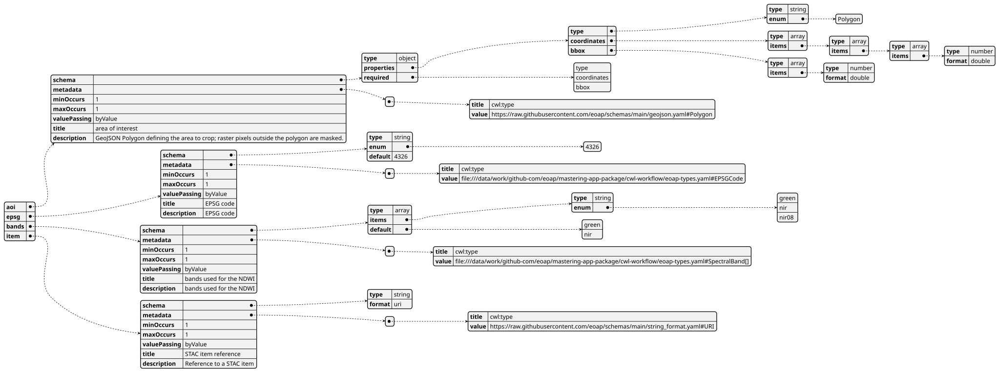
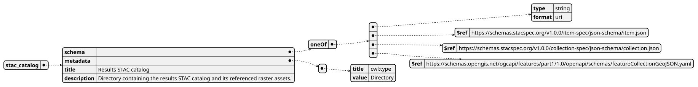
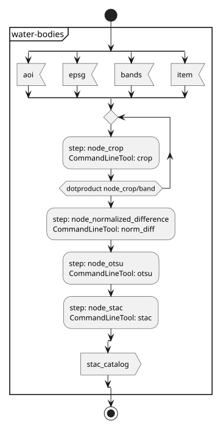
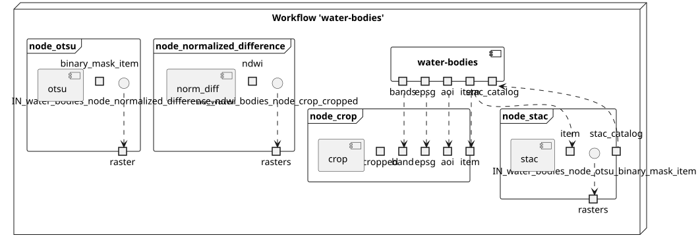
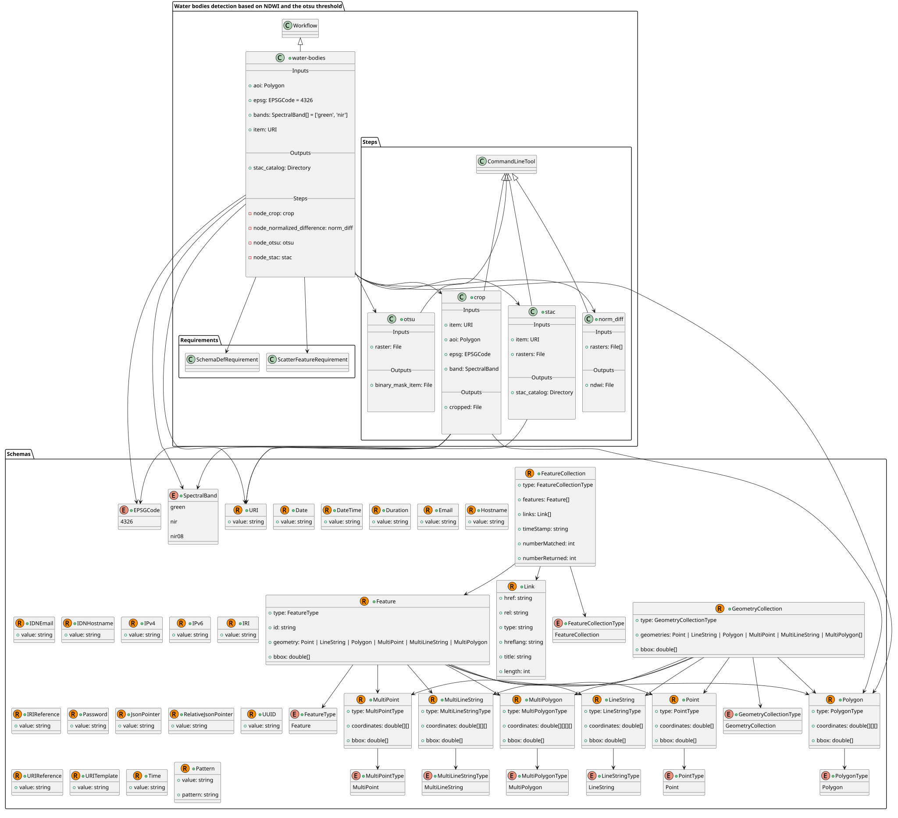
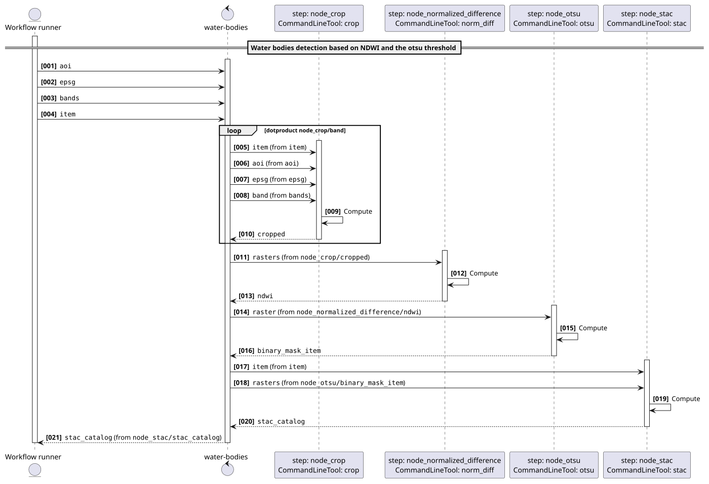
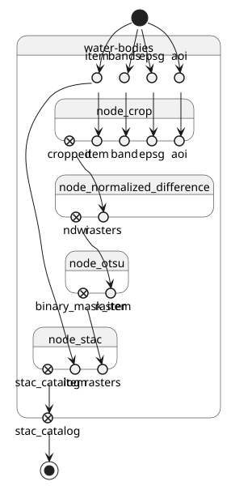

# Water bodies detection based on NDWI and the otsu threshold v1.0.0

Water bodies detection based on NDWI and otsu threshold applied to a single Sentinel-2 COG STAC item

> This software is licensed under the terms of the [Creative Commons Attribution-ShareAlike 4.0 International](https://creativecommons.org/licenses/by-sa/4.0/) license - SPDX short identifier: [CC-BY-SA-4.0](https://spdx.org/licenses/CC-BY-SA-4.0)
>
> 2022-09-01 - 2026-10-10T18:33:17.352 Copyright [EO Application Packaging](mailto:None) - > [https://github.com/eoap](https://github.com/eoap)

## Project Team

### Authors

| Name | Email | Organization | Role | Identifier |
|------|-------|--------------|------|------------|
| Doe, Jane | [jane.doe@acme.earth](mailto:jane.doe@acme.earth) | [ACME](None) | [N/A](None) | [None](None) |
| Doe, John | [john.doe@acme.earth](mailto:john.doe@acme.earth) | [ACME](None) | [N/A](None) | [None](None) |


### Contributors

The are no contributors for this project.


## Mastering Earth Observation Application Packaging with CWL

Mastering Earth Observation Application Packaging with CWL can be found on [https://eoap.github.io/mastering-app-package](https://eoap.github.io/mastering-app-package).


## Runtime environment

### Supported Operating Systems

The are no Supported Operating Systems specified for this project.


### Requirements

- [container runtime](container runtime)
- [cwl runner](cwl runner)


---


## water-bodies

### CWL Class

[Workflow](https://www.commonwl.org/v1.2/Workflow.html#Workflow)

### Requirements

* [ScatterFeatureRequirement](https://www.commonwl.org/v1.2/Workflow.html#ScatterFeatureRequirement)

### Inputs

| Id | Type | Label | Doc |
|----|------|-------|-----|
| `aoi` | [string](https://www.commonwl.org/v1.2/Workflow.html#CWLType) | area of interest | area of interest as a bounding box |
| `epsg` | [string](https://www.commonwl.org/v1.2/Workflow.html#CWLType) | EPSG code | EPSG code |
| `bands` | `array` of [string](https://www.commonwl.org/v1.2/Workflow.html#CWLType) | bands used for the NDWI | bands used for the NDWI |
| `item` | [string](https://www.commonwl.org/v1.2/Workflow.html#CWLType) | STAC item reference | Reference to a STAC item |


### Steps

| Id | Runs | Label | Doc |
|----|------|-------|-----|
| [node_crop](#crop) | `#crop` | Crop bands | Crop the selected bands to the area of interest. |
| [node_normalized_difference](#norm_diff) | `#norm_diff` | Compute NDWI | Compute the normalized difference water index from the cropped bands. |
| [node_otsu](#otsu) | `#otsu` | Detect water bodies | Apply the Otsu threshold to produce a binary water body mask. |
| [node_stac](#stac) | `#stac` | Catalog results | Create a STAC catalog describing the detected water bodies. |


### Outputs

| Id | Type | Label | Doc |
|----|------|-------|-----|
| `stac_catalog` | [Directory](https://www.commonwl.org/v1.2/Workflow.html#Directory) | Results STAC catalog | Directory containing the results STAC catalog and its referenced raster assets. |


### OGC API - Processes

When `water-bodies` [Workflow](https://www.commonwl.org/v1.2/Workflow.html#Workflow) is exposed through [OGC API - Processes - Part 1: Core](https://docs.ogc.org/is/18-062r2/18-062r2.html), `inputs` and `outputs` fields below represent the interface of the [getProcessDescription](https://developer.ogc.org/api/processes/index.html#tag/ProcessDescription/operation/getProcessDescription) API.


#### Inputs



#### Outputs




### UML Diagrams


#### Activity diagram

Learn more about the [Activity diagram](https://en.wikipedia.org/wiki/Activity_diagram) below.



#### Component diagram

Learn more about the [Component diagram](https://en.wikipedia.org/wiki/Component_diagram) below.



#### Class diagram

Learn more about the [Class diagram](https://en.wikipedia.org/wiki/Class_diagram) below.



#### Sequence diagram

Learn more about the [Sequence diagram](https://en.wikipedia.org/wiki/Sequence_diagram) below.



#### State diagram

Learn more about the [State diagram](https://en.wikipedia.org/wiki/State_diagram) below.




### Run in step

`node_crop`


## crop

### CWL Class

[CommandLineTool](https://www.commonwl.org/v1.2/CommandLineTool.html#CommandLineTool)

### Inputs

| Id | Option | Type |
|----|------|-------|
| `item` | `--input-item` | [string](https://www.commonwl.org/v1.2/Workflow.html#CWLType) |
| `aoi` | `--aoi` | [string](https://www.commonwl.org/v1.2/Workflow.html#CWLType) |
| `epsg` | `--epsg` | [string](https://www.commonwl.org/v1.2/Workflow.html#CWLType) |
| `band` | `--band` | [string](https://www.commonwl.org/v1.2/Workflow.html#CWLType) |

### Execution usage example:

```
python -m app \
--input-item <ITEM> \
--aoi <AOI> \
--epsg <EPSG> \
--band <BAND>
```

### Run in step

`node_normalized_difference`


## norm_diff

### CWL Class

[CommandLineTool](https://www.commonwl.org/v1.2/CommandLineTool.html#CommandLineTool)

### Inputs

| Id | Option | Type |
|----|------|-------|
| `rasters` | `--rasters` | `array` of [File](https://www.commonwl.org/v1.2/Workflow.html#File) |

### Execution usage example:

```
python -m app \
--rasters <RASTERS>
```

### Run in step

`node_otsu`


## otsu

### CWL Class

[CommandLineTool](https://www.commonwl.org/v1.2/CommandLineTool.html#CommandLineTool)

### Inputs

| Id | Option | Type |
|----|------|-------|
| `raster` | `--raster` | [File](https://www.commonwl.org/v1.2/Workflow.html#File) |

### Execution usage example:

```
python -m app \
--raster <RASTER>
```

### Run in step

`node_stac`


## stac

### CWL Class

[CommandLineTool](https://www.commonwl.org/v1.2/CommandLineTool.html#CommandLineTool)

### Inputs

| Id | Option | Type |
|----|------|-------|
| `item` | `--input-item` | [string](https://www.commonwl.org/v1.2/Workflow.html#CWLType) |
| `rasters` | `--water-body` | [File](https://www.commonwl.org/v1.2/Workflow.html#File) |

### Execution usage example:

```
python -m app \
--input-item <ITEM> \
--water-body <RASTERS>
```
