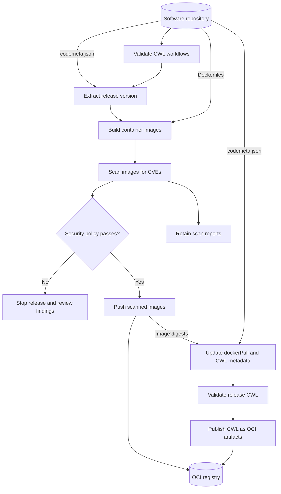

## Application Package Software Configuration Management

The SCM has the task of tracking and controlling changes in the software as a part of the larger cross-disciplinary field of configuration management. 

SCM practices include revision control and the establishment of baselines.

The Application Package code is hosted on a repository publicly accessible (Github, Bitbucket, a GitLab instance, an institutional software forge, etc.) using one of the version control systems supported by (Subversion, Mercurial and Git)

The Application Package code include, at the top level of the source code tree, the following files:

* README containing a description of the software (name, purpose, pointers to website, documentation, development platform, contact, and support information, …)
* AUTHORS, a list of all the persons to be credited for the software.
* LICENSE, the project license terms. For Open Source Licenses, the standard SPDX license names are used. For large software projects and developers, the REUSE (https://reuse.software/) process and tools can be an option to look at.
* codemeta.json, a linked data metadata file that helps index the source code in the Software Heritage archive and provides an easy way to link to other related research outputs.

The codemeta.json includes metadata information to support the Continuous Integration phase and it is shown below:

```json linenums="1" title="codemeta.json"
--8<--
codemeta.json
--8<--
```

## Application Package Continuous Integration

The release pipeline validates the CWL workflows, builds the application images,
checks those images for known vulnerabilities, and publishes the Application
Package as an OCI artifact. Container images and CWL artifacts can share an OCI
registry, with separate repositories for each application step and workflow.

The following diagram shows the target release process, including the image
security scan and OCI publication stages being introduced:



### Container image security scanning

Each built image will be scanned for known Common Vulnerabilities and Exposures
(CVEs) in its operating-system packages and application dependencies. Scanning
happens before release publication, and the image that passes the scan is the
one pushed to the registry.

The release policy must define which findings block publication, for example
high or critical vulnerabilities. A blocking finding stops the release so that
the affected base image or dependency can be updated, the image rebuilt, and the
scan repeated. Any accepted exception should have a documented reason and expiry.

Keep the scan report with the CI run, including the image identifier, scanner
version, vulnerability database version or timestamp, and findings. A successful
scan means that the image meets the policy against the database used for that
scan; newly disclosed vulnerabilities can require rescanning published images.

### Publishing CWL as OCI artifacts

In the target release process, the validated CWL documents are published as OCI
artifacts. Each artifact contains the release workflow and any local files needed
to resolve its imports or includes. The workflow references the published
container images through immutable digest references in `DockerRequirement.dockerPull`.

The CWL artifact receives a release tag derived from `codemeta.json`. Record its
registry digest as well: the tag identifies the release for readers, while the
digest identifies the exact published package. The CWL artifact digest and the
container image digests identify different objects.

An OCI client such as [ORAS](https://oras.land/docs/how_to_guides/pushing_and_pulling/)
can publish and retrieve these files. Consumers pull the CWL artifact, then pass
the retrieved workflow to a CWL runner; the runner obtains the container images
referenced by the workflow. See the [ORAS push command](https://oras.land/docs/commands/oras_push/)
for file media types and artifact publication options.

### Current GitHub Actions configuration

The configuration below is the current repository implementation. It publishes
container images, GitHub Actions artifacts, and GitHub release attachments.
The CVE scan and OCI publication stages described above still need to be added
to this workflow; GitHub artifact uploads alone do not publish CWL to an OCI registry.

```yaml linenums="1" title=".github/workflows/build.yaml"
--8<--
.github/workflows/build.yaml
--8<--
```
